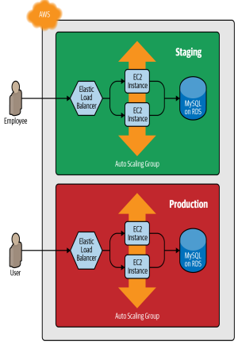

# Deploying a Cluster of Web Servers
In this project we are going to deploy a cluster of web servers using the following
- Auto Scaling Group(ASG)
- A Load Balancer to distribute traffic across the servers.

## Sate management
For managing the terraform state, I have used an S3 bucket as the reomte backend.
The following are the advantages of S3 as the backend for state management.
 - It's a managed service, so you don't need to deploy and manage extra infrastructure to use it.
 - It supports locking via DynamoDB.
 - It supports versioning, so every revision of your state file is stored, and you can roll back to an older version if something goes wrong.
With a remote backend and locking, collaboration is no longer a problem.

## A multi-environment
Typically we need at least two environments: one for your team's internal testing ("Staging") and one that real users can access("production"). Ideally, the two environments are nearly identical, though you might run slightly fewer/smaller servers in staging to save money.

## The infrastructure

### Problem
How do you add this production environment without having to copy and
paste all of the code from staging? For example, how do you avoid having
to copy and paste all the code in stage/services/webserver-cluster into
prod/services/webserver-cluster and all the code in stage/data-stores/mysql
into prod/data-stores/mysql?

## Solution (Modules)
With Terraform, you can put your code inside of a Terraform module and
reuse that module in multiple places throughout your code. Instead of
having the same code copied and pasted in the staging and production
environments, you’ll be able to have both environments reuse code from the
same module.

## The file structure

# Zero-downtime deployment
Now that our module has a clean and simple API for deploying a web
server cluster, an important question to ask is, how do you update that
cluster? That is, when you make changes to your code, how do you deploy
a new Amazon Machine Image (AMI) across the cluster? And how do you
do it without causing downtime for your users?
This problem can be overcome by using AWS native solution called instance refresh.

## Images demostrating Zero-downtime deployment.

